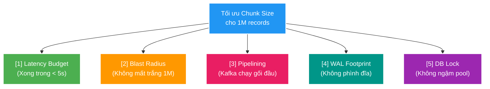
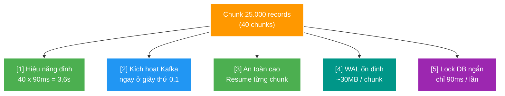

# 📊 Giải thích chi tiết: Tại sao chọn Chunk Size 25.000 cho BT-09B? (Trade-off & Mathematical Proof)

> **Mục đích tài liệu**: Phân tích kỹ thuật chuyên sâu từ First Principles giải thích lý do tại sao hệ thống chọn kích thước **25.000 records/chunk** (40 chunks) cho tiến trình Scan Decision (`BT-09B`) thay vì các phương án khác (như 2.000 hay 1.000.000).  
> **Áp dụng dự án**: `file_mngt_microservice` (PostgreSQL 17 / Workload SC-01 Approve 1M records).

---

## 1. Bản chất bài toán tối ưu hóa đa mục tiêu

Khi duyệt 1.000.000 records trong `scan-service`, kiến trúc sư phải cân bằng đồng thời **5 yếu tố vật lý mâu thuẫn nhau**:

---

## 2. Ma trận so sánh 4 kích thước Chunk điển hình

| Tiêu chí kỹ thuật | Chunk 2.000 *(Naive Loop)* | Chunk 10.000 *(Medium)* | **Chunk 25.000 *(Sweet Spot - Chọn)*** | Chunk 1.000.000 *(Single All-in-One)* |
| :--- | :---: | :---: | :---: | :---: |
| **Số lượng Chunks** | 500 chunks | 100 chunks | **40 chunks** | 1 chunk duy nhất |
| **Thời gian 1 Chunk** | $\sim 18\text{ms}$ | $\sim 45\text{ms}$ | **$\sim 90\text{ms}$** | $\sim 1.800\text{ms}$ |
| **Tổng thời gian Scan** | **$\sim 9,0\text{s}$ (Vỡ SLO ❌)** | $\sim 4,5\text{s}$ (Sát nút ⚠️) | **$\sim 3,6\text{s}$ (Đạt SLO ✅)** | $\sim 1,8\text{s}$ (Nhanh nhất ⚡) |
| **Độ trễ kích hoạt Kafka** | 18ms (Vụn vặt) | 45ms | **90ms (Cực tốt 🚀)** | **1.800ms (Phải chờ 1M xong ❌)** |
| **Blast Radius khi lỗi** | Mất tối đa 2k rows | Mất tối đa 10k rows | **Mất tối đa 25k rows (An toàn ✅)** | **Mất trắng 1.000.000 rows (Nguy hiểm ❌)** |
| **Khả năng Resume** | Tốt | Tốt | **Rất tốt (40 mốc Checkpoint) ✅** | **Không thể Resume ❌** |
| **Dung lượng WAL / Chunk** | $\sim 3\text{MB}$ | $\sim 12\text{MB}$ | **$\sim 30\text{MB}$ (Gọn gàng ✅)** | $\sim 1.500\text{MB}$ (Phình to đĩa ❌) |
| **Thời gian ngậm Lock DB** | 18ms $\times$ 500 lần | 45ms $\times$ 100 lần | **90ms $\times$ 40 lần (Mượt mà ✅)** | 1.800ms liên tục (Nghẽn bảng ❌) |

---

## 3. Phân tích First Principles: Tại sao loại bỏ 2 thái cực 2.000 và 1.000.000?

### ❌ Tại sao LOẠI BỎ Chunk 2.000 (Thái cực quá nhỏ)?
1. **Nghẽn chi phí `fsync` và Round-trips**:
   - 500 lần commit transaction $\implies$ **500 lần gọi lệnh hệ điều hành `fsync()`** để flush đĩa WAL.
   - Dù mỗi lần chỉ mất $3\text{ms}$, nhân với 500 lần đã ngốn trắng **$1,5\text{ giây}$ chỉ để đợi đĩa quay/flush**!
2. **Chi phí mạng và JDBC**: 500 lượt round-trip socket giữa Java và PostgreSQL làm tiêu tốn tổng cộng $\sim 9,0\text{ giây}$, ngốn mất 30% tổng ngân sách 30s của cả hệ thống.

---

### ❌ Tại sao LOẠI BỎ Chunk 1.000.000 (Thái cực quá to)?
1. **Triệt tiêu khả năng Chạy gối đầu (Pipelining / Stream Processing)**:
   - Nếu gom 1 triệu dòng vào 1 lệnh duy nhất: Outbox Relay (`BT-09C`) phải **ngồi chờ tới tận giây thứ 2** khi toàn bộ 1M records commit xong mới được phép đọc outbox.
   - Catalog và Query Service bị "bỏ đói" (Idle) trong 2 giây đầu tiên, biến hệ thống thành mô hình tuần tự (Stop-and-Wait).
2. **Blast Radius quá lớn (Chết chùm)**:
   - Nếu có sự cố (đứt mạng, hết disk, restart container) ở giây thứ 1,7 $\implies$ Postgres rollback toàn bộ 1 triệu bản ghi.
   - Hệ thống **không thể Resume** mà phải làm lại từ con số 0, lãng phí thời gian và làm sập hoàn toàn SLO 30 giây.
3. **Phình to WAL và Nghẽn Lock**:
   - 1 transaction 1,5GB WAL làm tắc nghẽn tiến trình Checkpointer, tăng vọt Replication Lag sang máy Standby, và giữ Exclusive Lock trên bảng trong suốt gần 2 giây.

---

## 4. Tại sao Chunk 25.000 là "Điểm vàng" (The Sweet Spot)?

Kích thước **25.000 records/chunk** là giao điểm tối ưu thỏa mãn hoàn hảo cả 5 tiêu chí:

### 🧮 Chứng minh toán học về Latency & Pipelining:
- **Thời gian Scan hoàn tất**:  
  $$T_{\text{Scan}} = 40 \text{ chunks} \times 90\text{ms} = 3.600\text{ms} = \mathbf{3,6\text{s}}$$
- **Độ trễ bắt đầu xử lý của Catalog (First Chunk Delivery)**:  
  $$T_{\text{First\_Chunk}} = 90\text{ms (Chunk 1 commit)} + 5\text{ms (Relay Kafka)} \approx \mathbf{95\text{ms}}$$
- **Kết quả**: Catalog và Query **bắt đầu xử lý dữ liệu ngay từ giây thứ 0,1** (thay vì phải chờ 2s–9s), giúp toàn bộ 3 service chạy gối đầu nhau như một dây chuyền sản xuất đồng bộ!
