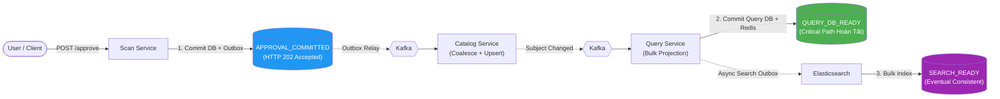

# Reference Capsule: BT-09A — Operation Contract & Watermark Flow

> Trích xuất từ: `docs/reviews/2026-08-13-approve-5000-query-performance-assessment.md` & `2026-08-14-linkedin-large-scale-data-processing.md`.
> Phạm vi: Áp dụng cho thiết kế contract và watermark của BT-09A.

---

## 1. Nguyên tắc cốt lõi

- **Không dùng Distributed Transaction (2PC/Saga nặng)**: Pipeline duyệt 1.000.000 records đi qua 3 database độc lập (`scan_db`, `catalog_db`, `query_db`).
- **Giao tiếp Asynchronous Event-Driven**: Phân tách rõ ràng giữa việc *nhận lệnh phê duyệt* và các *mốc hoàn thành thực tế (Watermarks)*.

---

## 2. Mô hình Watermark 3 Mốc (Lifecycle Stages)



| Watermark | Ý nghĩa kỹ thuật | SLA / Kỳ vọng |
| --- | --- | --- |
| **`APPROVAL_COMMITTED`** | Scan ghi nhận decision + outbox vào `scan_db`. HTTP trả về `202 Accepted` kèm `operationId`. | Ngay lập tức (< 1–2s cho request, chunking nền). |
| **`QUERY_DB_READY`** | Catalog đã cập nhật dữ liệu chuẩn và Query đã cập nhật Read Model + xóa Redis cache. Dữ liệu đã sẵn sàng trên Gallery Web. | Mốc hoàn tất của Critical Path (Target SLO). |
| **`SEARCH_READY`** | Elasticsearch đã cập nhật inverted index. Tách hoàn toàn khỏi critical path, chạy async. | Eventual consistency (chậm hơn vài giây không ảnh hưởng UI chính). |

---

## 3. Cấu trúc Contract Envelope chuẩn

Mỗi batch/event trong pipeline mang đầy đủ metadata sau:

```json
{
  "operationId": "018e6a12-xxxx-7xxx-axxx-xxxxxxxxxxxx",
  "batchId": "chunk-001-of-200",
  "partitionKey": "<subjectIdentity hoặc rootKey>",
  "eventVersion": 2,
  "occurredAt": "2026-08-15T22:00:00Z",
  "aggregateId": "subject-uuid",
  "aggregateVersion": 14,
  "payload": { ... }
}
```

- **`partitionKey`**: Bắt buộc group theo `subjectIdentity` (hoặc `rootKey`) để Kafka bảo đảm thứ tự tuần tự của các event trên cùng một subject.
- **`aggregateVersion`**: Catalog và Query dùng version này để bảo vệ tính nhất quán (Optimistic Version Guard), chặn stale/out-of-order events.
