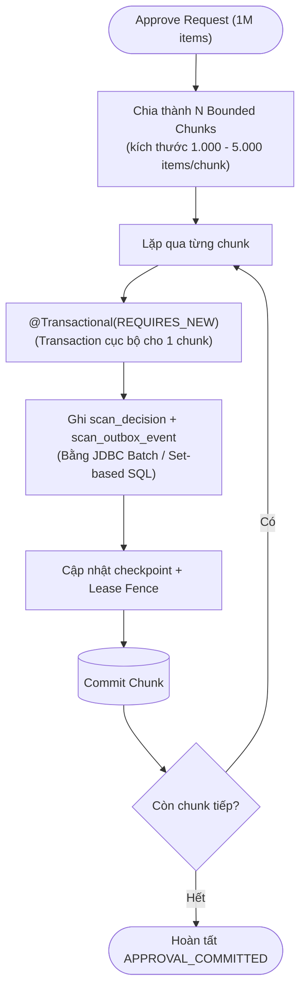

# Reference Capsule: BT-09B — Scan Decision & Outbox Chunking

> Trích xuất từ: `docs/reviews/2026-08-13-approve-5000-query-performance-assessment.md` (Section 1 & P1) & `2026-08-12-backend-quality-architecture-production-readiness.md` (TD-012).
> Phạm vi: Áp dụng cho write hot-path của Scan khi duyệt 1.000.000 records.

---

## 1. Vấn đề & Anti-Patterns cần tránh

- **JPA `saveAll()` trên 1M records**: Tạo 1.000.000 Hibernate entity objects trong RAM, trigger dirty checking liên tục, tràn JVM Heap và GC pause kéo dài.
- **Transaction 1M dòng đơn lẻ**: Giữ PostgreSQL transaction mở quá lâu, làm phình WAL log, chiếm giữ connection pool và tăng nguy cơ deadlock / rollback toàn bộ khi có 1 lỗi nhỏ.

---

## 2. Thiết kế Bounded Transaction Chunks

---

## 3. Quy tắc kỹ thuật bắt buộc

1. **Transaction độc lập**: Mỗi chunk chạy trong transaction độc lập (`REQUIRES_NEW`), commit ngay khi xong chunk đó. Nếu gặp crash, chỉ rollback chunk hiện tại; các chunk trước đó đã an toàn trong database.
2. **Atomic Decision + Outbox**: Ghi cả `scan_decision` và `scan_outbox_event` trong cùng 1 transaction chunk. Không bao giờ commit decision mà quên outbox event.
3. **Không hydrate Entity**: Dùng JDBC batch (`rewriteBatchedStatements=true`) hoặc native `INSERT ... SELECT` / `COPY`, không load toàn bộ entity vào Hibernate persistence context.
4. **Lease Owner Fencing**: Mọi câu lệnh update checkpoint đều phải kèm điều kiện `WHERE lease_owner = :currentWorker AND lease_expires_at > NOW()`.
