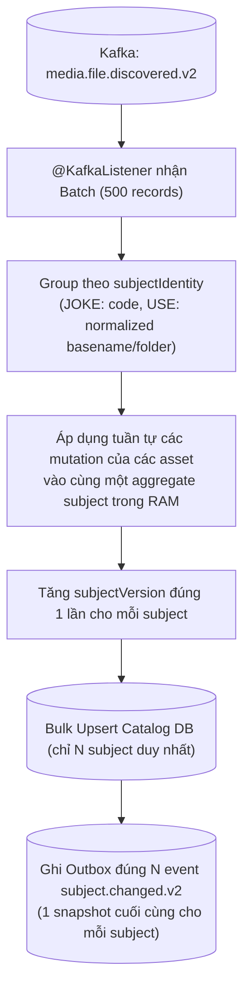

# Reference Capsule: BT-09D — Catalog Batch Coalescing

> Trích xuất từ: `docs/reviews/2026-08-13-approve-5000-query-performance-assessment.md` (Section 3 & P0) & `2026-08-14-linkedin-large-scale-data-processing.md` (Section 2).
> Phạm vi: Áp dụng cho Catalog Service consumer khi nhận hàng loạt event `media.file.discovered.v2`.

---

## 1. Vấn đề: Event & Write Amplification tại Catalog

- **Hiện trạng nguy hiểm**: 1.000.000 file discovered đến Catalog. Nếu Catalog xử lý từng event trong 1 transaction riêng:
  - 1.000.000 DB transactions độc lập.
  - Một subject chứa 50 ảnh/video sẽ bị `SELECT -> UPDATE -> COMMIT` 50 lần liên tiếp, gây lock contention nặng nề trên cùng 1 row `media_subject`.
  - Catalog lại phát ngược ra 1.000.000 event `subject.changed.v1` sang Kafka, làm nghẽn tiếp Query Service.

---

## 2. Giải pháp: In-Memory Batch Coalescing (Samza Model)

---

## 3. Các quy tắc kỹ thuật

1. **Kafka Batch Consumer**: Cấu hình listener dạng `List<ConsumerRecord<String, DiscoveredFilePayload>>`.
2. **Coalesce theo Subject Identity**:
   - Nếu trong batch 500 file có 20 file thuộc cùng một Album/Video subject, toàn bộ 20 asset này được gộp vào aggregate subject trong RAM.
   - Chỉ thực hiện 1 lần ghi DB và phát sinh đúng **1 event snapshot cuối cùng** cho subject đó.
   - **Giảm tải (De-amplification)**: Giảm từ 1.000.000 event xuống chỉ còn ~100.000 - 300.000 event downstream.
3. **Bulk Upsert DB**: Dùng JDBC batch hoặc native SQL cho bảng `media_subject` và `media_asset`, tránh gọi Hibernate `save()` lặp từng record.
4. **Idempotency & Version Guard**: Kiểm tra `processed_event` và tăng `version` aggregate để ngăn chặn ghi đè trùng lặp.
