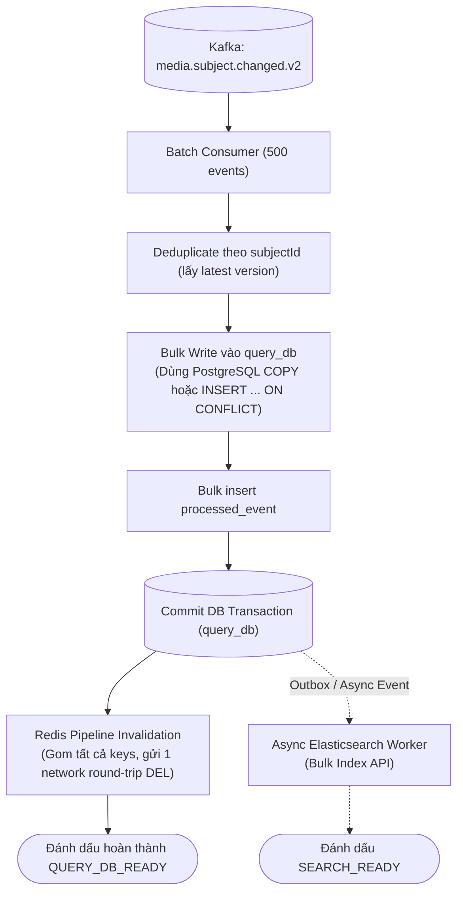

# Reference Capsule: BT-09E — Query Bulk Projection & Redis Pipeline

> Trích xuất từ: `docs/reviews/2026-08-13-approve-5000-query-performance-assessment.md` (Section 4, 5, 6 & P0/P1) & `2026-08-14-linkedin-large-scale-data-processing.md` (Section 4).
> Phạm vi: Áp dụng cho Query Service khi cập nhật Read Model từ event `media.subject.changed.v2`.

---

## 1. Vấn đề của Query Service cũ

- **Per-record Projection Transaction**: Mỗi event mở 1 transaction, xóa sạch và chèn lại các child collection (`assets`, `tags`, `preview_items`), tạo hàng ngàn câu lệnh DELETE/INSERT rời rạc.
- **Redis Invalidation đơn lẻ**: Gửi từng lệnh `DEL` qua Redis network round-trip cho từng subject, làm chậm luồng commit DB.
- **Elasticsearch publisher đồng bộ**: Giữ transaction database trong khi gọi HTTP sang Elasticsearch cluster.

---

## 2. Thiết kế Bulk Projection & Pipeline Invalidation

---

## 3. Các quy tắc kỹ thuật bắt buộc

1. **Deduplicate trong Batch**: Nếu 1 batch có nhiều event cho cùng 1 `subjectId`, chỉ giữ lại event có `aggregateVersion` cao nhất để ghi xuống Read Model.
2. **Bulk Upsert Read Model**:
   - Sử dụng set-based SQL `INSERT ... ON CONFLICT (subject_id) DO UPDATE` với điều kiện `WHERE EXCLUDED.aggregate_version >= query_subject.aggregate_version`.
   - Chặn đứng hoàn toàn rủi ro out-of-order event ghi đè dữ liệu mới bằng dữ liệu cũ.
3. **Redis Pipeline Invalidation**:
   - **Chỉ thực hiện sau khi DB transaction đã commit thành công** (qua `@TransactionalEventListener(phase = AFTER_COMMIT)`).
   - Sử dụng Redis Pipeline để gom hàng trăm key `del("subject:" + id)` vào một lệnh batch duy nhất.
4. **Tách hoàn toàn Elasticsearch khỏi Critical Path**:
   - Ghi search outbox table hoặc publish search event nội bộ.
   - Worker riêng biệt dùng Elasticsearch `_bulk` API (ví dụ: gom 1.000 items/request) để cập nhật search index, không làm chậm `QUERY_DB_READY`.
