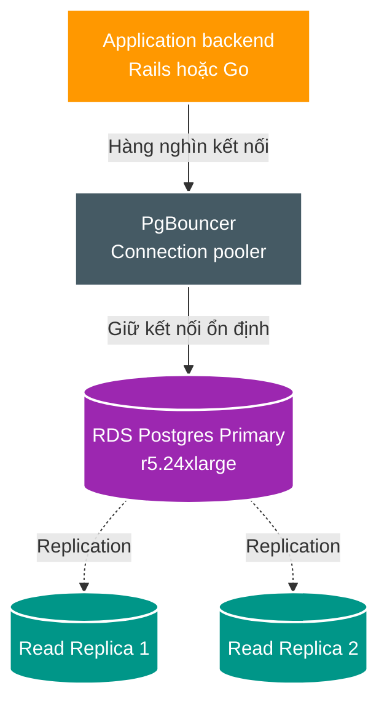
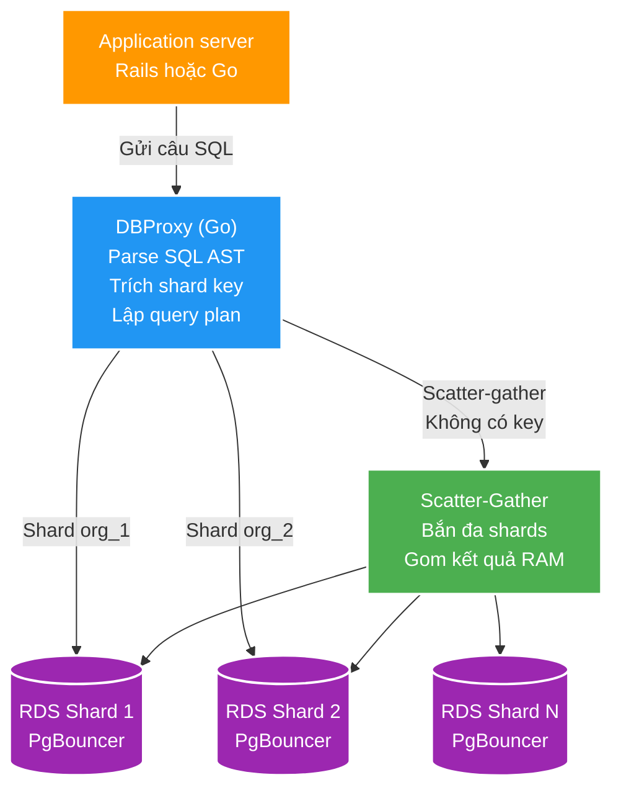
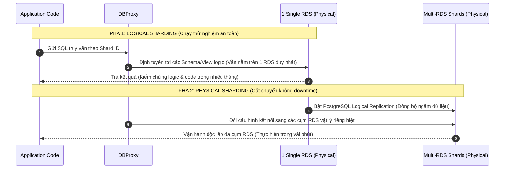

# Cách Figma Mở rộng Quy mô sang Nhiều Cơ sở Dữ liệu PostgreSQL

> Nguồn: [Figma Engineering Blog](https://www.figma.com/blog/how-figma-scaled-to-multiple-databases/)  
> Tác giả: Đội ngũ Hạ tầng Figma (Figma Infrastructure Team)  
> Xuất bản: 04/04/2023  
> Thu thập: 17/08/2026  

Vào năm 2020, hạ tầng của Figma bắt đầu đối mặt với những "cơn đau tăng trưởng" (growing pains) do sự kết hợp của nhiều tính năng mới, quá trình chuẩn bị ra mắt sản phẩm thứ hai và lượng người dùng tăng vọt (lưu lượng truy cập cơ sở dữ liệu tăng xấp xỉ gấp 3 lần mỗi năm). Chúng tôi biết rằng hạ tầng từng nâng đỡ Figma trong những năm đầu sẽ không thể tiếp tục mở rộng để đáp ứng nhu cầu tương lai. Khi đó, chúng tôi vẫn đang sử dụng **một cụm cơ sở dữ liệu Amazon RDS (PostgreSQL) đơn lẻ, cỡ lớn** để lưu trữ hầu hết metadata của hệ thống — bao gồm phân quyền, thông tin file và các bình luận (comments). Mặc dù cụm máy chủ này xử lý mượt mà nhiều tính năng cộng tác cốt lõi, nhưng một máy vật lý duy nhất luôn có giới hạn vật lý của nó. 

Dấu hiệu rõ ràng nhất là chúng tôi quan sát thấy mức sử dụng CPU vượt ngưỡng **65% vào các khung giờ cao điểm** do khối lượng truy vấn khổng lồ đổ dồn vào một database duy nhất. Độ trễ (latency) của cơ sở dữ liệu ngày càng trở nên khó dự đoán khi mức sử dụng tiệm cận giới hạn chịu tải, gây ảnh hưởng trực tiếp đến trải nghiệm của người dùng cuối.

Nếu cơ sở dữ liệu bị bão hòa hoàn toàn (100% CPU/IO), Figma sẽ ngừng hoạt động.

Chúng tôi vẫn còn cách xa kịch bản tồi tệ đó, nhưng với tư cách là một đội ngũ hạ tầng, mục tiêu của chúng tôi là chủ động nhận diện và khắc phục các vấn đề mở rộng quy mô trước khi chúng trở thành mối đe dọa cận kề. Chúng tôi cần xây dựng một giải pháp vừa giảm thiểu sự bất ổn tiềm tàng, vừa mở đường cho quy mô tăng trưởng dài hạn. Thêm vào đó, hiệu năng và độ tin cậy luôn là ưu tiên hàng đầu; mục tiêu của chúng tôi là xây dựng một nền tảng bền vững cho phép các kỹ sư liên tục cập nhật sản phẩm mà không làm gián đoạn trải nghiệm người dùng. Nếu hạ tầng của Figma giống như một hệ thống đường cao tốc, chúng tôi không thể đơn giản là đóng cửa toàn bộ đường cao tốc chỉ để sửa chữa nó.

---

## Các Giải pháp Tình thế: Mua thêm Thời gian Dự phòng (Runway)

Chúng tôi bắt đầu bằng một số giải pháp tình thế ngắn hạn để có thêm một năm thời gian dự phòng, đồng thời đặt nền móng cho một phương pháp tiếp cận toàn diện hơn:

1. **Mở rộng theo chiều dọc (Vertical Scaling)**: Nâng cấp cơ sở dữ liệu lên loại instance lớn nhất có thể của AWS (từ `r5.12xlarge` lên `r5.24xlarge`) để tối đa hóa dung lượng CPU dự phòng.
2. **Bổ sung các Bản sao chỉ đọc (Read Replicas)**: Tạo nhiều Read Replicas để phân tải lưu lượng đọc (SELECT) ra khỏi nút ghi chính (Primary Writer).
3. **Tách Database riêng cho các Nghiệp vụ mới**: Thiết lập các cơ sở dữ liệu độc lập cho các tính năng và sản phẩm mới toanh để hạn chế tải phát sinh lên cụm database gốc.
4. **Sử dụng PgBouncer quản lý Connection Pool**: Đưa PgBouncer vào giữa ứng dụng và PostgreSQL RDS để quản lý hiệu quả hàng nghìn kết nối đồng thời từ các application pods.

Mặc dù các giải pháp tình thế này đã giải tỏa áp lực tức thời, chúng bộc lộ những giới hạn không thể vượt qua:
* **Gánh nặng từ thao tác Ghi (Writes)**: Các câu lệnh INSERT, UPDATE, DELETE vẫn chiếm phần lớn CPU và I/O của nút ghi chính. Không có Read Replica nào có thể gánh được tải ghi này.
* **Độ trễ sao chép (Replication Lag)**: Nhiều nghiệp vụ quan trọng trong ứng dụng đòi hỏi tính nhất quán tức thì (read-your-own-writes), không thể đọc từ replica do sợ dính replication lag.

Đã đến lúc chúng tôi phải dừng các bản vá chắp vá và tìm kiếm một giải pháp mở rộng theo chiều ngang (Horizontal Scaling) lâu dài.

---

## Khảo sát các Phương án: Tại sao KHÔNG chọn NoSQL hay NewSQL?

Chúng tôi đã đánh giá kỹ lưỡng các phương án mở rộng ngang phổ biến trên thị trường:

1. **Chuyển đổi sang NoSQL (DynamoDB / Cassandra) hoặc Vitess (MySQL)**: 
   * Đòi hỏi một cuộc đại phẫu thuật di chuyển dữ liệu (Dual-write / Dual-read) cực kỳ rủi ro và phức tạp.
   * Quan trọng hơn, NoSQL sẽ phá vỡ toàn bộ mô hình dữ liệu quan hệ (relational model) và buộc phải viết lại toàn bộ tầng logic nghiệp vụ của ứng dụng.
2. **Chuyển sang NewSQL phân tán tương thích Postgres (Distributed SQL)**:
   * Ở quy mô của Figma, chúng tôi sẽ trở thành một trong những khách hàng có cụm database phân tán trên cloud lớn nhất thế giới. Chúng tôi không muốn biến mình thành "chuột bạch" để gánh chịu những lỗi tiềm ẩn của các giải pháp phân tán mới nổi mà bản thân chưa nắm rõ mã nguồn.
3. **Tự vận hành (Self-hosting) hệ thống database phân tán phức tạp**:
   * Tiêu tốn quá nhiều nguồn lực vận hành và bảo trì, làm phân tán sự tập trung của đội ngũ kỹ sư khỏi các bài toán tăng trưởng cốt lõi.

Thay vì chuyển sang một công nghệ hoàn toàn xa lạ, chúng tôi quyết định **tiếp tục gắn bó sâu sắc với PostgreSQL** và mở rộng nó một cách bài bản qua hai giai đoạn: **Phân vùng theo chiều dọc (Vertical Partitioning)** kết hợp **Sharding theo chiều ngang thông qua DBProxy**.

---

## Phân vùng theo Chiều dọc (Vertical Partitioning / Database Federation)

Phân vùng theo chiều dọc là việc di chuyển các nhóm bảng (tables) độc lập theo từng domain nghiệp vụ sang các cụm database PostgreSQL vật lý riêng biệt.

Để xác định các bảng cần tách, chúng tôi dựa trên hai tiêu chí khắt khe:
1. **Mức độ tác động (Workload Impact)**: Các bảng có chỉ số *Average Active Sessions (AAS)* cao nhất (đo lường bằng cách lấy mẫu `pg_stat_activity` mỗi 10 mili-giây).
2. **Mức độ độc lập (Isolation)**: Các bảng ít hoặc không có ràng buộc khóa ngoại (Foreign Keys), ít câu lệnh JOIN và không tham gia vào các transaction ACID xuyên bảng với phần còn lại của ứng dụng.

### Đánh đổi bắt buộc khi Phân vùng Dọc:
Khi tách bảng sang các database khác nhau, bạn sẽ mất hoàn toàn:
* Khả năng JOIN bằng câu lệnh SQL thông thường giữa các bảng thuộc database khác nhau.
* Ràng buộc Khóa ngoại (Foreign Key constraints) ở tầng DB.
* Các Transaction nguyên tử (Atomic Transactions) ở tầng DB.

Tất cả các logic liên kết này bắt buộc phải được chuyển lên giải quyết ở **tầng ứng dụng (Application Layer)**.

---

## Phân mảnh theo Chiều ngang (Horizontal Sharding) và DBProxy

Đối với những bảng dữ liệu khổng lồ không thể giải quyết trọn vẹn chỉ bằng việc tách dọc (những bảng chứa hàng trăm triệu bản ghi như metadata file, quyền truy cập), Figma áp dụng giải pháp Sharding theo chiều ngang.

### DBProxy: Bộ não điều phối truy vấn thông minh
Figma tự phát triển một query proxy hiệu năng cao bằng ngôn ngữ **Go** mang tên **DBProxy**:
1. **Phân tích cú pháp SQL (AST Parsing)**: Chuyển đổi câu truy vấn SQL thành cây cú pháp trừu tượng (Abstract Syntax Tree).
2. **Trích xuất Shard Key**: Tự động bóc tách mệnh đề `WHERE` để tìm khóa phân mảnh (ví dụ: `file_id` hoặc `org_id`).
3. **Định tuyến truy vấn (Routing)**:
   * **Targeted Query**: Nếu câu query có chứa Shard Key, DBProxy sẽ gửi thẳng câu lệnh tới đúng Shard Database đích.
   * **Scatter-Gather Query**: Nếu câu query không có Shard Key, DBProxy sẽ phân tán (fan-out) câu lệnh tới toàn bộ các Shard cùng lúc, sau đó gom (gather) và hợp nhất kết quả trong bộ nhớ trước khi trả về cho ứng dụng.

---

## Chiến lược Triển khai An toàn 2 Pha: Sharding Logic trước khi Sharding Vật lý

Để loại bỏ hoàn toàn thời gian chết (zero downtime) và phòng tránh thảm họa khi di chuyển dữ liệu lớn, Figma áp dụng quy trình 2 pha cực kỳ kỷ luật:

1. **Pha 1 — Logical Sharding (Sharding mức Logic)**:
   * Toàn bộ mã nguồn ứng dụng được cập nhật để đi qua DBProxy như thể dữ liệu đã bị chia cắt ra hàng chục database.
   * Tuy nhiên, trên thực tế, tất cả các logical shards này **vẫn nằm trên cùng 1 instance RDS vật lý duy nhất**.
   * Điều này cho phép Figma kiểm chứng toàn bộ logic định tuyến, ranh giới transaction và hành vi của ứng dụng trong môi trường production suốt nhiều tháng mà không phải di chuyển một byte dữ liệu nào giữa các server.
2. **Pha 2 — Physical Sharding (Sharding mức Vật lý)**:
   * Khi tầng logic đã chứng minh được sự ổn định tuyệt đối, dữ liệu từng shard được đồng bộ ngầm sang các cụm RDS vật lý mới thông qua **PostgreSQL Logical Replication**.
   * Quá trình chuyển đổi (cutover) cho từng bảng diễn ra an toàn chỉ trong vài phút mà người dùng không hề cảm nhận được sự gián đoạn.

Nhờ chiến lược kiến trúc phân tầng vững chắc này, Figma đã mở rộng dung lượng cơ sở dữ liệu lên **hơn 100 lần** mà vẫn duy trì độ khả dụng tuyệt đối và tốc độ phát triển tính năng của toàn công ty.
