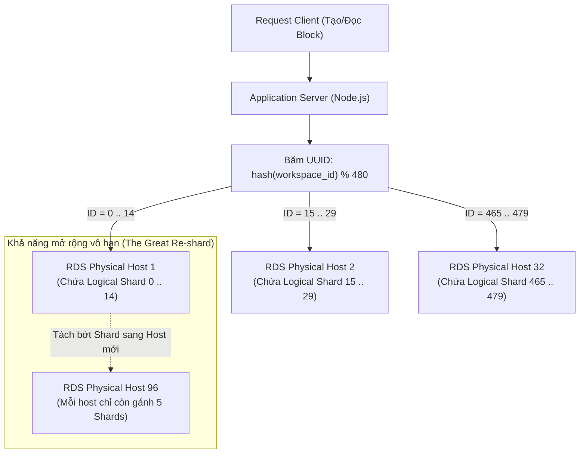
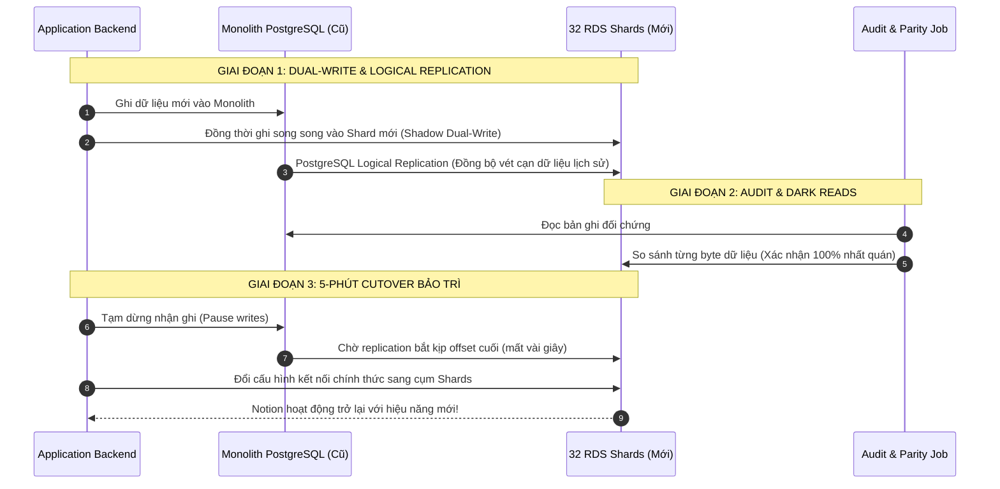

# Dẫn dắt đàn Voi: Những Bài học Thực chiến từ việc Sharding PostgreSQL tại Notion

> Nguồn: [Notion Engineering Blog](https://www.notion.so/blog/sharding-postgres-at-notion)  
> Tác giả: Đội ngũ Hạ tầng Notion (Notion Infrastructure Team)  
> Xuất bản: 06/10/2021  
> Thu thập: 17/08/2026  

Đầu năm nay, chúng tôi đã tạm dừng hệ thống Notion trong vòng 5 phút để bảo trì theo lịch trình. Trong khi thông báo ra bên ngoài chỉ ngắn gọn là "nâng cao tính ổn định và hiệu năng", thì phía sau hậu trường là kết quả đỉnh cao của nhiều tháng làm việc tập trung và khẩn trương của toàn đội ngũ: **phân mảnh (sharding) cụm cơ sở dữ liệu PostgreSQL nguyên khối (monolith) của Notion thành một dàn cơ sở dữ liệu phân vùng theo chiều ngang**.

Quá trình chuyển đổi (cutover) đã thành công vang dội trong sự vui mừng khôn xiết của đội ngũ kỹ sư. Người dùng nhanh chóng nhận thấy tốc độ của ứng dụng được cải thiện vượt bậc. Nhưng 5 phút bảo trì ngắn ngủi đó không nói lên toàn bộ câu chuyện. Đội ngũ chúng tôi đã mất nhiều tháng trời để thiết kế kiến trúc cho cuộc đại phẫu thuật di chuyển dữ liệu này nhằm giúp Notion chạy nhanh hơn và đáng tin cậy hơn trong nhiều năm tới.

Dưới đây là câu chuyện chi tiết về cách chúng tôi thực hiện sharding PostgreSQL và những bài học kinh nghiệm đã tích lũy trên hành trình này.

---

## Thời điểm Quyết định Cần phải Sharding

Sharding là một cột mốc lớn trong nỗ lực không ngừng nghỉ nhằm cải thiện hiệu năng ứng dụng. Đến giữa năm 2020, mức độ sử dụng sản phẩm đã vượt xa khả năng chịu tải của cụm PostgreSQL nguyên khối trung thành — cỗ máy đã phục vụ chúng tôi suốt 5 năm qua 4 bậc độ lớn (orders of magnitude) về tăng trưởng. Hàng tỷ block, file và workspace mới liên tục được tạo ra, khiến CPU thường xuyên chạm đỉnh (spike) và các đợt migration schema đơn giản nhất cũng trở nên rủi ro và khó lường.

Đối với các startup đang phát triển nhanh, việc sharding quá sớm mang lại gánh nặng bảo trì khổng lồ và áp đặt nhiều ràng buộc phức tạp lên code ứng dụng. Tuy nhiên, đối với Notion, thời điểm bùng phát không thể trì hoãn (inflection point) đã ập đến khi:

1. **Tiến trình `VACUUM` của PostgreSQL liên tục bị đình trệ (Stall)**: Dung lượng các bảng phình to lên nhiều Terabytes khiến autovacuum không thể dọn dẹp các bản ghi rác (dead tuples) kịp tốc độ sinh ra, làm phình to kích thước đĩa (table bloat) và suy giảm hiệu năng I/O nghiêm trọng.
2. **Nguy cơ cuốn vòng mã giao dịch (Transaction ID - TXID Wraparound)**: Trong PostgreSQL, mã giao dịch (TXID) là số nguyên 32-bit. Nếu autovacuum không kịp đóng băng (freeze) các TXID cũ trước khi chạm ngưỡng 2 tỷ transactions, PostgreSQL sẽ **tự động khóa toàn bộ thao tác ghi (Stop all writes)** để bảo vệ dữ liệu khỏi bị ghi đè. Đây là một mối đe dọa sống còn (existential threat) đối với sự tồn tại của sản phẩm.

---

## Thiết kế Kiến trúc Sharding ở Tầng Ứng Dụng (Application-Level Sharding)

Thay vì dựa vào các giải pháp middleware/clustering có sẵn nhưng mờ đục (như Citus cho Postgres hay Vitess cho MySQL), Notion chọn giải pháp **Sharding ở Tầng Ứng Dụng (Application-Level Sharding)** để nắm toàn quyền kiểm soát tuyệt đối đối với việc định tuyến truy vấn, ranh giới transaction và vị trí lưu trữ dữ liệu.

### 1. Phân mảnh những Dữ liệu nào?
Mô hình dữ liệu của Notion xoay quanh khái niệm **Block** (cây nội dung do người dùng tạo ra). Chúng tôi quyết định sharding:
* Bảng trung tâm `block`.
* Tất cả các bảng liên quan có ràng buộc khóa ngoại tới block (như `space`, `discussion`, `comment`).
* Việc gom toàn bộ các bảng liên đới này về cùng một Shard vật lý giúp bảo toàn tính toàn vẹn dữ liệu (Data Locality) và tránh được các transaction phân tán (Distributed 2PC) cực kỳ đắt đỏ giữa các máy chủ khác nhau.

### 2. Chọn Khóa Phân Mảnh (Partition Key): `workspace_id`
Chúng tôi chọn `workspace_id` (kiểu UUID) làm Partition Key:
* **Bảo toàn Tính cục bộ (Data Locality)**: Toàn bộ các block, page, discussion thuộc về cùng một workspace sẽ luôn nằm trọn vẹn trên cùng một database shard.
* Mọi thao tác cộng tác bên trong một workspace đều giữ nguyên 100% tính chất **ACID Transaction** của cơ sở dữ liệu quan hệ.
* Các truy vấn xuyên workspace (Cross-workspace) hầu như không phát sinh trong mô hình cộng tác của Notion.

### 3. Sức mạnh của Con số 480 Logical Shards
Notion đưa vào một tầng trừu tượng cực kỳ thông minh: **Logical Shards (Shard Logic) ánh xạ tới Physical Hosts (Máy chủ Vật lý)**.

* Chúng tôi chia dữ liệu thành **480 Logical Shards** (mỗi shard là một schema/database logic riêng biệt).
* Ban đầu, 480 Logical Shards này được phân bổ đều lên **32 máy chủ vật lý AWS RDS PostgreSQL** (mỗi máy chủ gánh 15 logical shards).
* **Tại sao lại là con số 480?** Số 480 có số lượng ước số cực kỳ phong phú (chia hết cho 2, 3, 4, 5, 6, 8, 10, 12, 15, 16, 20, 24, 30, 32, 40, 48, 60, 80, 96, 120, 160, 240).
* Khi lưu lượng tiếp tục bùng nổ vào năm 2023 (*"The Great Re-shard"*), Notion dễ dàng mở rộng từ 32 máy chủ lên **96 máy chủ vật lý** (mỗi máy chỉ còn gánh 5 logical shards) bằng cách di chuyển các bucket schema mà **không cần phải sửa đổi bất kỳ một dòng code routing nào của ứng dụng**!

---

## Chiến lược Di chuyển Dữ liệu và Cutover Không Downtime

Để di chuyển hàng trăm Terabytes dữ liệu đang hoạt động trực tiếp sang cụm sharding mới, Notion xây dựng một pipeline 4 giai đoạn chuẩn mực:

1. **Ghi Kép (Dual-Write / Shadow Writes)**: Ứng dụng được cập nhật để ghi dữ liệu mới/sửa đổi đồng thời vào cả database cũ và cụm sharding mới.
2. **Sao chép Logic cho Dữ liệu Lịch sử (Logical Replication)**: Sử dụng PostgreSQL Logical Replication để stream liên tục toàn bộ dữ liệu lịch sử từ monolith sang các shard đích.
3. **Kiểm toán Nhất quán (Audit & Dark Reads)**: Các tiến trình worker chạy ngầm liên tục đọc và so sánh chéo từng byte dữ liệu giữa 2 bên để bảo đảm tính nhất quán 100% trước khi bấm nút chuyển đổi.
4. **Cắt chuyển trong 5 Phút (5-Minute Cutover)**: Trong khung giờ bảo trì ngắn, ứng dụng tạm dừng nhận request ghi, replication đuổi kịp chỉ trong vài giây, cấu hình định tuyến được trỏ sang cụm shards mới và Notion mở lại phục vụ người dùng.

---

## Những Bài Học Đắt Giá (Key Lessons Learned)

1. **Sharding theo Ranh giới Nghiệp vụ Cốt lõi (`workspace_id`)**: Việc gom các thực thể có quan hệ mật thiết về chung một shard vật lý giúp duy trì trọn vẹn sức mạnh của ACID Transaction và loại bỏ hoàn toàn nhu cầu về Two-Phase Commit (2PC) phân tán.
2. **Sử dụng Logical Shards làm Tầng Trung gian**: Tuyệt đối không ánh xạ trực tiếp Shard Key vào địa chỉ IP của máy chủ vật lý. Việc chia nhỏ thành 480 Logical Shards giúp việc cắm thêm máy chủ vật lý (re-sharding) sau này chỉ mất vài giờ thay vì nhiều tháng trời.
3. **Coi chừng Giới hạn Mềm (Soft Limits) trước khi chạm Giới hạn Phần cứng**: Hiện tượng Autovacuum đình trệ và nguy cơ TXID Wraparound sẽ đánh sập PostgreSQL từ rất lâu trước khi ổ cứng của bạn kịp đầy.
