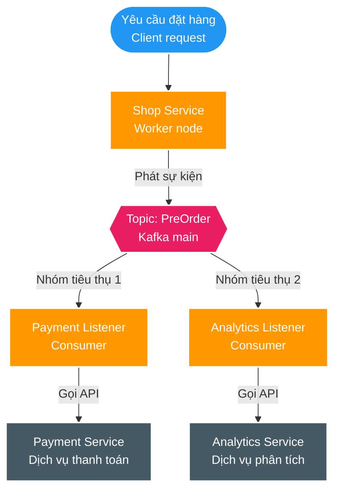
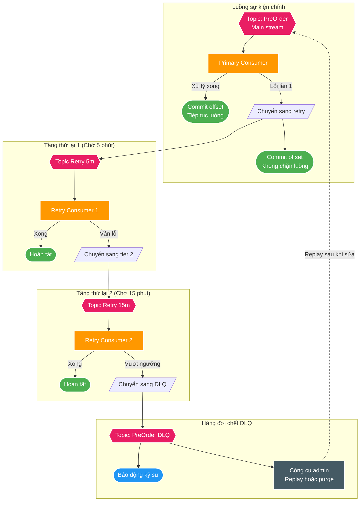

# Xây dựng Kiến trúc Xử lý lại Bền vững và Dead Letter Queue với Apache Kafka

> Nguồn: [Uber Engineering Blog](https://www.uber.com/blog/reliable-reprocessing/)  
> Tác giả: Uber Insurance Engineering Team  
> Xuất bản: 22/02/2018  
> Thu thập: 17/08/2026  

Trong các hệ thống phân tán, việc thử lại (retry) là điều tất yếu. Từ lỗi mạng tạm thời, sự cố sao chép dữ liệu (replication), cho đến việc các dịch vụ phụ thuộc phía hạ nguồn (downstream dependencies) gặp sự cố ngừng hoạt động, các dịch vụ vận hành ở quy mô lớn bắt buộc phải chuẩn bị sẵn sàng để phát hiện, phân loại và xử lý lỗi một cách mềm dẻo và an toàn nhất có thể.

Với quy mô và tốc độ phát triển của Uber, hệ thống của chúng tôi phải đảm bảo khả năng chịu lỗi cao (fault-tolerant) và tuyệt đối không được thỏa hiệp khi xử lý các tình huống thất bại. Để đạt được điều này, chúng tôi tận dụng **Apache Kafka**, một nền tảng truyền thông điệp phân tán mã nguồn mở đã được kiểm chứng thực tế trong ngành về khả năng cung cấp hiệu năng vượt trội ở quy mô lớn.

Dựa trên các đặc tính này, đội ngũ Kỹ sư Bảo hiểm của Uber (Uber Insurance Engineering) đã mở rộng vai trò của Kafka trong kiến trúc hướng sự kiện (event-driven architecture) sẵn có bằng cách áp dụng cơ chế **tái xử lý yêu cầu không chặn (non-blocking request reprocessing)** và **hàng đợi thông điệp chết (Dead Letter Queue - DLQ)** nhằm đạt được khả năng xử lý lỗi tách rời, có thể quan sát được (observable) mà không làm gián đoạn lưu lượng xử lý thời gian thực. Chiến lược này giúp chương trình *Driver Injury Protection* của chúng tôi vận hành tin cậy trên hơn 200 thành phố, tự động khấu trừ phí bảo hiểm theo từng dặm cho mỗi chuyến đi của các tài xế đăng ký tham gia.

Trong bài viết này, chúng tôi làm nổi bật phương pháp tiếp cận để xử lý lại các yêu cầu trong các hệ thống lớn với cam kết thời gian thực (real-time SLAs) và chia sẻ những bài học kinh nghiệm đắt giá đã tích lũy.

---

## Vận hành trong Kiến trúc Hướng sự kiện (Event-Driven Architecture)

Hệ thống backend của *Driver Injury Protection* được đặt trong một kiến trúc truyền thông điệp Kafka, chạy qua một dịch vụ Java kết nối với nhiều dependency khác nhau bên trong hệ sinh thái microservices rộng lớn của Uber. Tuy nhiên, trong khuôn khổ bài viết này, chúng tôi tập trung cụ thể vào chiến lược thử lại (retry) và đưa vào hàng đợi chết (dead-lettering), minh họa qua một ứng dụng lý thuyết quản lý việc đặt hàng trước (pre-order) các sản phẩm cho một doanh nghiệp thương mại điện tử đang bùng nổ.

Trong mô hình này, chúng tôi muốn thực hiện đồng thời hai việc:
1. Thực hiện thanh toán tiền hàng (Make a payment).
2. Tạo một bản ghi dữ liệu riêng biệt lưu lại thông tin đặt hàng trước của từng người dùng để phục vụ phân tích dữ liệu sản phẩm theo thời gian thực (Real-time product analytics).

Điều này hoàn toàn tương đồng với cách một khoản phí chuyến đi trong chương trình *Driver Injury Protection* được backend xử lý: vừa phải trừ tiền thực tế, vừa phải ghi một bản ghi riêng phục vụ báo cáo kế toán.

Mỗi chức năng này được cung cấp thông qua API của dịch vụ tương ứng. Khi nhận được yêu cầu đặt hàng, `Shop Service` sẽ phát (publish) một thông điệp `PreOrder` chứa các dữ liệu liên quan vào Kafka topic `PreOrder`. Từ đó, hai nhóm consumer tương ứng sẽ đọc sự kiện này để thực thi logic nghiệp vụ riêng và gọi dịch vụ đích (`Payment Service` và `Analytics Service`).

Một giải pháp nhanh và đơn giản nhất để triển khai retry là sử dụng vòng lặp phản hồi (feedback loop) ngay tại điểm gọi client. Ví dụ: nếu `Payment Service` bị tăng độ trễ và bắt đầu ném ra ngoại lệ timeout, `Shop Service` sẽ tiếp tục gọi lại `makePayment` theo một giới hạn số lần retry nhất định (kết hợp backoff) cho đến khi thành công hoặc chạm ngưỡng dừng.

---

## Vấn đề nghiêm trọng của cơ chế Retry đơn giản (Simple Retries)

Mặc dù retry trực tiếp tại tầng client qua vòng lặp có thể hữu ích cho các tác vụ nhỏ, nhưng trong các hệ thống quy mô lớn, cơ chế này gặp phải những điểm nghẽn nghiêm trọng:

1. **Tắc nghẽn xử lý hàng loạt (Clogged Batch Processing / Head-of-Line Blocking)**:
   * Khi chúng tôi phải xử lý khối lượng lớn thông điệp theo thời gian thực, các thông điệp bị lỗi liên tục sẽ làm tắc nghẽn toàn bộ luồng xử lý.
   * Những thông điệp "độc hại" (poison pills) hoặc dịch vụ đích bị sập sẽ liên tục vượt quá giới hạn retry, tiêu tốn nhiều thời gian và tài nguyên CPU/thread nhất.
   * Nếu không nhận được phản hồi thành công, Kafka Consumer sẽ **không thể commit offset mới**. Toàn bộ partition đó sẽ bị chặn đứng (blocked) do consumer phải tiêu thụ lại thông điệp lỗi đó lặp đi lặp lại nhiều lần. Hàng nghìn thông điệp mới và hợp lệ đến sau buộc phải đứng xếp hàng chờ đợi, gây ra độ trễ (lag) khổng lồ cho hệ thống.

2. **Khó khăn trong việc thu thập và theo dõi Metadata**:
   * Rất khó theo dõi ngữ cảnh lỗi, dấu thời gian (timestamps) và số lần đã retry (*n-th retry*) khi mọi thứ chỉ diễn ra trong bộ nhớ cục bộ của một thread.

3. **Cạn kiệt tài nguyên & Hiệu ứng sụp đổ dây chuyền (Cascading Failures)**:
   * Các đợt retry dồn dập, đồng loạt vào một dịch vụ hạ nguồn đang chao đảo sẽ giống như một đợt tấn công từ chối dịch vụ (DDoS nội bộ), đẩy downstream service vào trạng thái sụp đổ hoàn toàn.

Khi các yêu cầu tiếp tục thất bại sau nhiều lần thử, chúng tôi cần thu thập các lỗi này vào một **Dead Letter Queue (DLQ)** để phục vụ giám sát và chẩn đoán. Một hệ thống DLQ chuẩn mực cần cung cấp:
* **Listing (Liệt kê)**: Xem nội dung các thông điệp đang nằm trong hàng đợi chết.
* **Purging (Dọn dẹp)**: Xóa bỏ các thông điệp rác hoặc không còn giá trị.
* **Merging / Reprocessing (Xử lý lại)**: Đẩy ngược lại các thông điệp chết vào luồng xử lý sau khi sự cố gốc đã được các kỹ sư khắc phục triệt để.

---

## Xử lý trong các Hàng đợi Tách biệt (Non-blocking Retry Architecture)

Để giải quyết triệt để vấn đề nghẽn cổ chai của cơ chế retry đồng bộ, chúng tôi tách rời hoàn toàn luồng xử lý lỗi và retry ra khỏi luồng sự kiện chính bằng cách sử dụng **hệ thống các Retry Topics phân tầng kết hợp với Dead Letter Queue**.

### 1. Các Retry Topic Phân tầng với Cơ chế Trì hoãn (Tiered Delayed Topics)
Thay vì bắt Kafka Consumer của topic chính phải `Thread.sleep()` hoặc lặp lại chờ đợi:
1. Khi một thông điệp xử lý thất bại, Consumer sẽ đóng gói thông điệp đó kèm theo metadata lỗi trong Kafka Headers (số lần đã retry, mã lỗi, stack trace, timestamp ban đầu) và phát nó sang **Retry Topic cấp 1** (`pre-order-retry-5m`).
2. Ngay sau khi phát thông điệp retry thành công, **Consumer lập tức commit offset trên topic chính**. Phân vùng (partition) chính được giải phóng ngay tức khắc để đọc các thông điệp tiếp theo mà không hề bị trễ một mili-giây nào.
3. Một nhóm Consumer riêng biệt sẽ lắng nghe trên `pre-order-retry-5m`. Consumer này áp dụng thời gian chờ (ví dụ 5 phút) trước khi gọi lại downstream service, giúp downstream service có thời gian hồi phục.
4. Nếu xử lý lại vẫn thất bại, thông điệp được chuyển tiếp sang **Retry Topic cấp 2** (`pre-order-retry-15m`) với thời gian giãn cách lớn hơn.

### 2. Dead Letter Queue (DLQ) làm Trạng thái Kết thúc (Terminal State)
Khi một thông điệp đã vét cạn toàn bộ số lần thử lại cho phép trên tất cả các tầng retry:
1. Thông điệp được định tuyến vào **Dead Letter Queue** (`pre-order-dlq`).
2. Hệ thống dừng việc tự động retry thông điệp này để tránh lãng phí tài nguyên.
3. DLQ đóng vai trò là "khu vực cách ly", kích hoạt cảnh báo tới các kỹ sư trực chiến, cung cấp khả năng chẩn đoán nguyên nhân gốc và hỗ trợ công cụ quản trị (Admin Tool) để phát lại (replay) toàn bộ hoặc từng phần khi sự cố đã được sửa.

---

## Các Bài Học Kinh Nghiệm Cốt Lõi (Key Lessons Learned)

1. **Tách rời (Decoupling) là yếu tố sống còn**: Việc cô lập hoàn toàn luồng xử lý lỗi sang các topic độc lập giúp bảo vệ luồng dữ liệu thời gian thực không bị ảnh hưởng bởi những thông điệp lỗi đơn lẻ hay sự chậm chạp của downstream services.
2. **Tuyệt đối KHÔNG BAO GIỜ chặn luồng Kafka Consumer**: Việc dùng `Thread.sleep()` hoặc vòng lặp chờ đồng bộ bên trong Consumer Listener sẽ làm tê liệt toàn bộ các partition được gán cho consumer đó, đồng thời có nguy cơ làm rớt heartbeat và kích hoạt chuỗi rebalance consumer group tai hại.
3. **Bảo toàn Ngữ cảnh trong Kafka Headers**: Luôn truyền tải đầy đủ Trace Context, Correlation ID, Timestamp gốc và lịch sử số lần thử thông qua Kafka Headers qua từng chặng retry để phục vụ Distributed Tracing (Jaeger/Zipkin).
4. **DLQ phải có quy trình vận hành rõ ràng**: Một hàng đợi chết chỉ thực sự phát huy giá trị nếu có quy trình giám sát, cảnh báo chủ động và công cụ hỗ trợ kỹ sư tái xử lý (replay/purge) dữ liệu an toàn.
