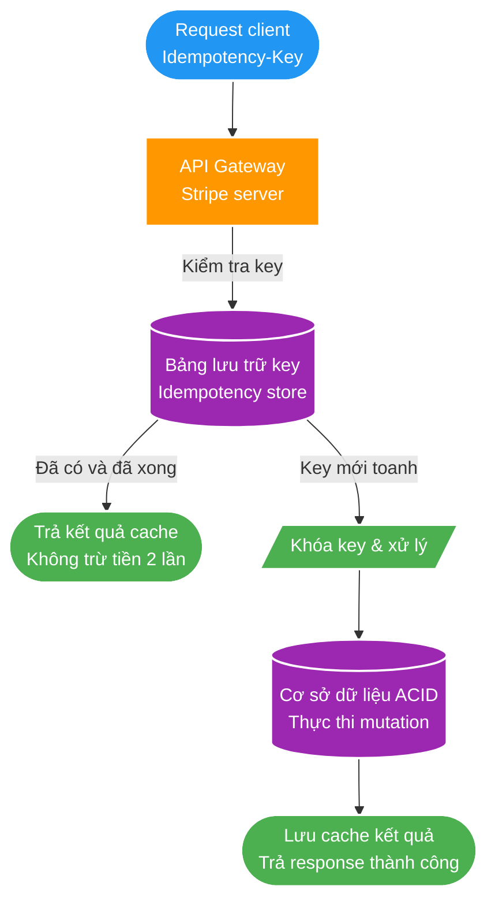

# Thiết kế API bền vững và dễ dự đoán bằng idempotency

> Nguồn: [Stripe](https://stripe.com/blog/idempotency)  
> Tác giả: Brandur Leach  
> Xuất bản: 22/02/2017

Network là [unreliable](https://en.wikipedia.org/wiki/Fallacies_of_distributed_computing). Network giữa các server đáng tin cậy hơn last-mile của người dùng, nhưng outage, lỗi routing và lỗi gián đoạn vẫn xảy ra. API và client phải chịu được failure và đưa integration phức tạp về trạng thái nhất quán.

## Lập kế hoạch cho failure

Một call giữa hai node có thể lỗi khi client đang kết nối, lỗi giữa lúc server xử lý khiến work rơi vào trạng thái không rõ, hoặc xử lý thành công nhưng connection đứt trước khi response tới client. Mỗi trường hợp khiến client không chắc request đã được thực thi hay chưa. Lỗi trước khi thực thi thường retry an toàn, còn lỗi giữa operation là ambiguous failure. Ngay cả một API và một client cũng tạo thành distributed system.

## Dùng idempotency rộng rãi

Cách dễ nhất để xử lý distributed state không nhất quán là làm endpoint server **idempotent**: có thể gọi nhiều lần nhưng side effect chỉ xảy ra một lần. Khi client nhận error, nó retry đến khi xác nhận thành công. Ví dụ DNS request chứa toàn bộ record mong muốn có thể gọi lặp; nếu record đã tồn tại, server bỏ qua duplicate và trả success.

Theo HTTP semantics, [`PUT` và `DELETE` là idempotent](https://tools.ietf.org/html/rfc7231#section-4.2.2). [`PUT`](https://tools.ietf.org/html/rfc7231#section-4.3.4) tạo hoặc thay thế target bằng payload; partial modification thường dùng [`PATCH`](https://tools.ietf.org/html/rfc5789).

## Đảm bảo semantics “exactly once”

Một số operation, chẳng hạn charge tiền khách hàng, không được chạy hai lần. **Idempotency key** là unique ID do client tạo cho một operation và gửi kèm request. Server liên kết ID với state của operation. Retry dùng cùng key có thể xử lý an toàn.

Nếu connection fail, retry có thể là lần đầu server nhìn thấy request. Nếu fail giữa lúc xử lý, server hoàn tất hoặc khôi phục operation; nếu ACID database đã rollback thì retry toàn bộ là an toàn. Nếu server đã thành công nhưng response mất, server trả lại cached result.

Stripe triển khai idempotency key cho mutation endpoint, gồm `POST`, qua header `Idempotency-Key`. Request lỗi có thể retry với cùng key mà không charge khách hàng hai lần.

## Là công dân tốt trong distributed system

Retry an toàn chưa đủ; retry cũng phải có trách nhiệm. Lỗi transient có thể biến mất, nhưng incident trên server có thể kéo dài và retry sẽ làm suy giảm nặng hơn. Client nên dùng [exponential backoff](https://en.wikipedia.org/wiki/Exponential_backoff), chờ tăng theo `2^n` khi số lần lỗi tăng.

Nên thêm randomness vào thời gian chờ. Nếu nhiều client lỗi đồng thời và retry cùng lịch, chúng có thể tạo **thundering herd** làm quá tải server đang hồi phục. Random jitter phân tán retry và cho server thời gian xử lý.

[Stripe Ruby library](https://github.com/stripe/stripe-ruby) tự retry bằng idempotency key, backoff tăng dần và jitter; implementation có tại [GitHub](https://github.com/stripe/stripe-ruby/blob/1bb9ac48b916b1c60591795cdb7ba6d18495e82d/lib/stripe/stripe_client.rb#L78-L92).

## Chuẩn hóa thiết kế API bền vững

Xử lý failure là nền tảng của API bền vững và dễ dự đoán. Client retry logic và server idempotency là các kỹ thuật có thể dùng trong mọi technology stack:

* **Xử lý failure nhất quán:** client retry remote operation; nếu không, state có thể không nhất quán.
* **Xử lý failure an toàn:** dùng idempotency và idempotency key để retry an toàn.
* **Xử lý failure có trách nhiệm:** dùng exponential backoff và random jitter, không dồn tải vào server đang degraded.
