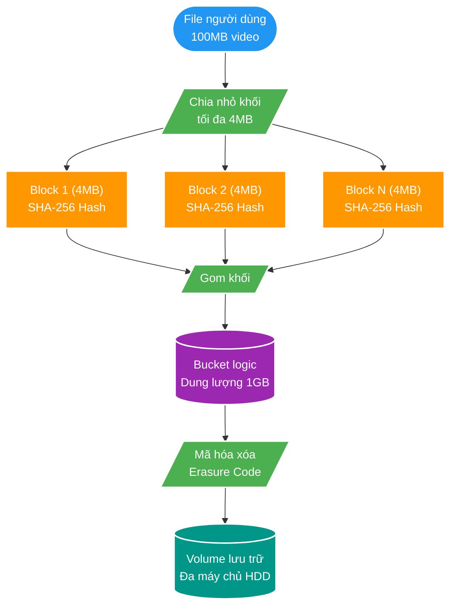
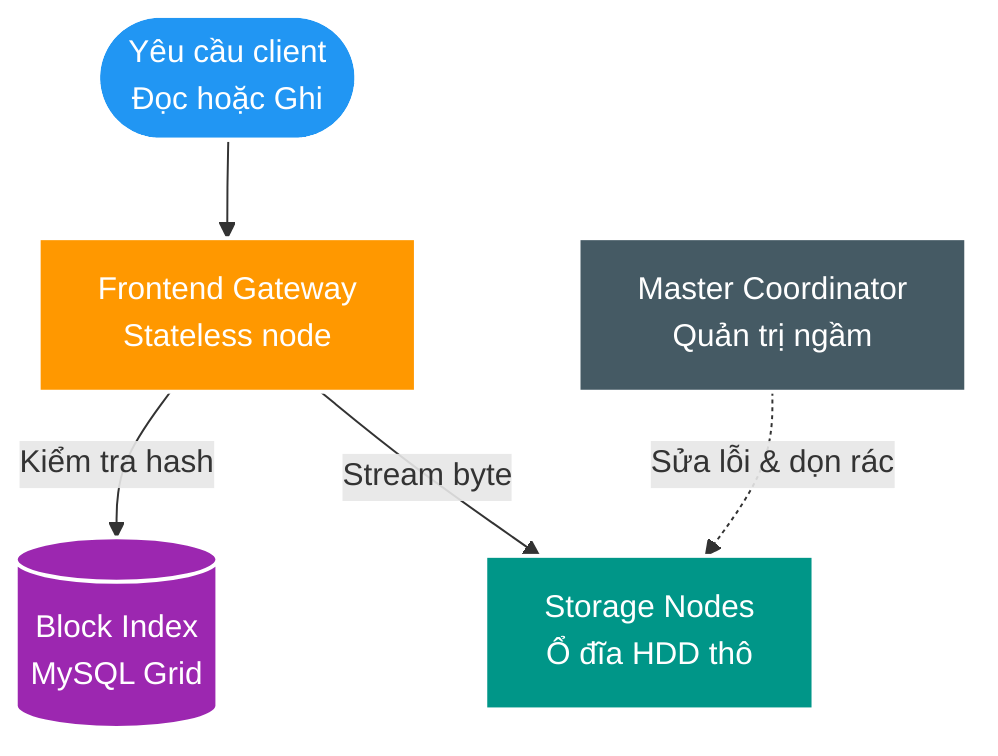

# Khám phá Magic Pocket: Hệ thống Lưu trữ Quy mô Hàng Exabyte Tự phát triển của Dropbox

> Nguồn: [Dropbox Tech Blog](https://dropbox.tech/infrastructure/inside-the-magic-pocket)  
> Tác giả: James Cowling (Đội ngũ Hạ tầng Dropbox)  
> Xuất bản: 25/05/2016  
> Thu thập: 17/08/2026  

Dropbox lưu trữ hai loại dữ liệu cơ bản và tách biệt hoàn toàn:
1. **Nội dung Tệp tin (File Content)**: Các byte dữ liệu thô thực tế của người dùng (ảnh, video, tài liệu, file nén).
2. **Siêu dữ liệu (Metadata)**: Thông tin về tệp tin (tên file, đường dẫn, kích thước), lịch sử chỉnh sửa (revisions), cây thư mục, quyền truy cập và thông tin tài khoản người dùng.

**Magic Pocket (viết tắt là MP)** là hệ thống lưu trữ phân tán tùy chỉnh quy mô lớn do chính Dropbox tự nghiên cứu và phát triển để lưu trữ hàng **Exabyte** nội dung tệp tin. Toàn bộ các file tải lên Dropbox đều được băm nhỏ thành các khối dữ liệu bất biến (immutable blocks), nhân bản nhiều bản sao để bảo đảm độ bền vững (durability), và phân tán trên hạ tầng máy chủ đặt tại nhiều vùng địa lý khác nhau.

Dưới đây là bức tranh kiến trúc tổng thể của Magic Pocket và các nguyên lý cốt lõi giúp hệ thống đạt độ bền vững gần như tuyệt đối.

---

## Các Yêu Cầu Cốt Lõi và Triết Lý Thiết Kế Kiến Trúc

### 1. Hệ thống Lưu trữ Khối Bất Biến (Immutable Block Storage)
Magic Pocket là một **hệ thống lưu trữ khối bất biến**. Nó lưu trữ các khối dữ liệu đã được mã hóa với kích thước tối đa **4 Megabytes (4MB)**. Một khi khối dữ liệu đã được ghi thành công vào hệ thống, nó **vĩnh viễn không bao giờ bị sửa đổi**.

Tính chất bất biến (Immutability) giúp đơn giản hóa thiết kế hệ thống phân tán một cách ngoạn mục:
* Không cần cơ chế khóa phân tán (Distributed Locking) phức tạp khi có nhiều người cùng chỉnh sửa.
* Không cần kiểm soát đồng thời đa phiên bản (MVCC) ở tầng lưu trữ đĩa thô.
* Khi người dùng chỉnh sửa một file trên máy tính, Dropbox ghi nhận toàn bộ chuỗi thay đổi này vào một hệ thống siêu dữ liệu riêng biệt gọi là **FileJournal**. Logic xử lý việc thay đổi (mutability) được đưa lên tầng cao hơn trong stack phần mềm, trong khi tầng lưu trữ khối bên dưới luôn thuần túy là **Append-Only (chỉ ghi thêm)**.

### 2. Đặc thù Tải trọng (Workload) và Lựa chọn Ổ cứng
Dropbox có đặc tính "cục bộ theo thời gian" (temporal locality) rất cao: các file vừa tải lên thường được truy cập rất nhiều trong vòng 1 giờ đầu (để đồng bộ sang điện thoại, laptop của đồng nghiệp), nhưng sau đó tần suất truy cập sẽ giảm dần. Tuy nhiên, khi người dùng cần tìm lại một file tài liệu từ 10 năm trước, hệ thống vẫn phải phản hồi tức thì với độ trễ thấp.
* **Ổ đĩa quay truyền thống (HDD)**: Được dùng làm phương tiện lưu trữ chính cho các khối dữ liệu vì giá thành rẻ, dung lượng lưu trữ cực kỳ đậm đặc và độ bền cao.
* **Ổ đĩa thể rắn (SSD) và RAM**: Được dành riêng cho các cơ sở dữ liệu siêu dữ liệu (Metadata DB) và các tầng Cache để tối ưu hóa tốc độ tìm kiếm index.

### 3. Độ Bền Vững Tuyệt Đối (Durability)
Độ bền vững dữ liệu là tiêu chí không thể thương lượng. Magic Pocket bảo vệ dữ liệu trước mọi thảm họa phần cứng và thiên tai bằng:
* **Mã hóa Xóa (Erasure Coding)**: Chia nhỏ dữ liệu thành $N$ khối dữ liệu và $M$ khối chẵn lẻ (parity blocks). Nhờ đó, hệ thống có thể mất đồng thời nhiều ổ cứng trong một cụm mà không hề mất một byte dữ liệu nào, với chi phí dung lượng thấp hơn nhiều so với việc nhân bản 3 lần thông thường.
* **Sao chép Đa Vùng Địa lý (Multi-Zone Geographic Replication)**: Lưu trữ các bản sao độc lập tại ít nhất 2 vùng địa lý cách xa nhau hàng nghìn dặm (bờ Đông, miền Trung và bờ Tây nước Mỹ).

### 4. Triệt để Đơn giản hóa (Simplicity over Complexity)
Việc triển khai các giao thức đồng thuận phân tán phức tạp (như Paxos/Raft) trên hàng triệu ổ đĩa thường tiềm ẩn nhiều lỗi góc (edge cases). Magic Pocket né tránh các cơ chế đồng thuận phân tán phức tạp ở tầng dữ liệu sống, thay vào đó tận dụng sự phối hợp tập trung có khả năng chịu lỗi cao: sử dụng một **lưới cơ sở dữ liệu quan hệ MySQL sharding khổng lồ** để quản lý chỉ mục khối (Block Index).

---

## Mô Hình Dữ Liệu: Khối (Blocks), Thùng (Buckets), và Tập hợp (Volumes)

1. **Khối (Block)**: Là đơn vị dữ liệu thô cơ bản, kích thước tối đa 4MB, đã được nén và mã hóa. Tên định danh (Key) của mỗi block chính là **Mã băm SHA-256** của chính nội dung khối đó (*Content-Addressable Storage - CAS*). Nhờ vậy, nếu 100 người dùng cùng tải lên 1 bài hát giống nhau, hệ thống chỉ lưu đúng 1 block duy nhất (Deduplication tự động).
2. **Thùng (Bucket)**: Việc quản lý hàng tỷ block 4MB riêng lẻ sẽ gây quá tải cho hệ thống quản lý siêu dữ liệu. Magic Pocket gom hàng trăm block được tải lên cùng thời điểm vào một thùng chứa logic dung lượng **1 Gigabyte (1GB Bucket)**.
3. **Tập hợp (Volume)**: Là một hoặc nhiều Bucket được nhân bản hoặc mã hóa xóa (Erasure Coded) trên một tập hợp các nút lưu trữ vật lý cụ thể.

---

## Kiến Trúc Phân Tầng Bên Trong một Storage Zone

Bên trong mỗi trung tâm dữ liệu (Zone), Magic Pocket được cấu trúc thành 4 thành phần tách biệt rõ ràng:

1. **Cổng giao tiếp Frontend (Frontends - Stateless Gateways)**:
   * Tiếp nhận các request đọc/ghi từ client.
   * **Khi Ghi (`PUT`)**: Tính mã băm SHA-256 của block. Kiểm tra trong `Block Index` xem hash này đã tồn tại chưa. Nếu đã có $\to$ báo thành công ngay (Deduplication tức thì). Nếu chưa $\to$ stream dữ liệu xuống các Storage Nodes, nhận xác nhận `fsync` an toàn rồi mới ghi nhận vào `Block Index`.
   * **Khi Đọc (`GET`)**: Tra cứu `Block Index` để lấy ID của Bucket và vị trí byte offset, sau đó stream trực tiếp dữ liệu từ Storage Node gần nhất về cho client.
2. **Chỉ mục Khối (Block Index - Lưới MySQL Sharding)**:
   * Hệ thống cơ sở dữ liệu quan hệ được sharding theo hash của block, lưu trữ bảng ánh xạ: `Block Hash -> Bucket ID, Offset, Size`.
3. **Nút Lưu trữ Dữ liệu (Storage Nodes - OSDs)**:
   * Các máy chủ gắn hàng chục ổ cứng HDD dung lượng cao.
   * Là các worker "thuần túy thực thi" (dumb workers): Chỉ nhận các lệnh đọc/ghi byte thô cơ bản (`put_block`, `get_block`, `fsync`) mà không cần hiểu kiến trúc toàn cục của cụm.
4. **Bộ Điều phối Master (Master Coordinator & Janitor)**:
   * **Hoàn toàn KHÔNG nằm trên luồng dữ liệu sống (Out of Data Path)**.
   * Chịu trách nhiệm thực hiện các tác vụ ngầm: theo dõi nhịp tim (heartbeat) của các Storage Nodes, tự động tái tạo dữ liệu sang ổ đĩa mới khi phát hiện ổ đĩa hỏng, dọn dẹp các khối dữ liệu bị xóa (Garbage Collection) và gom các Bucket nhỏ để thực hiện nén Erasure Coding.

---

## Những Bài Học Kiến Trúc Đắt Giá (Key Lessons Learned)

1. **Tách biệt Triệt để giữa File Content (Blob) và Metadata**: Lưu trữ dữ liệu nhị phân dung lượng lớn trong một hệ thống khối bất biến (Append-Only) và lưu siêu dữ liệu quan hệ trong Database sharding mang lại hiệu năng cao nhất và chi phí lưu trữ tối ưu nhất.
2. **Content-Addressable Storage (CAS) với SHA-256**: Sử dụng mã băm nội dung làm khóa định danh giúp hệ thống tự động loại bỏ dữ liệu trùng lặp (Deduplication) ở cấp độ toàn cầu mà không tốn thêm tài nguyên xử lý.
3. **Giữ cho các Storage Nodes thật đơn giản**: Các nút lưu trữ chỉ nên làm nhiệm vụ I/O đĩa đơn thuần. Việc đưa toàn bộ logic điều phối lên các Frontend không trạng thái và Master chạy ngầm giúp cô lập hoàn toàn lỗi, tránh tình trạng sụp đổ dây chuyền trên toàn cụm.
